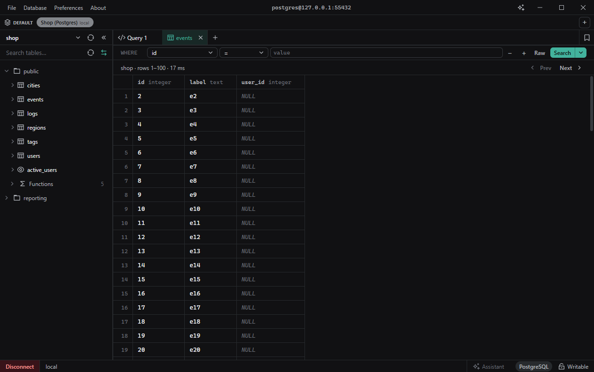
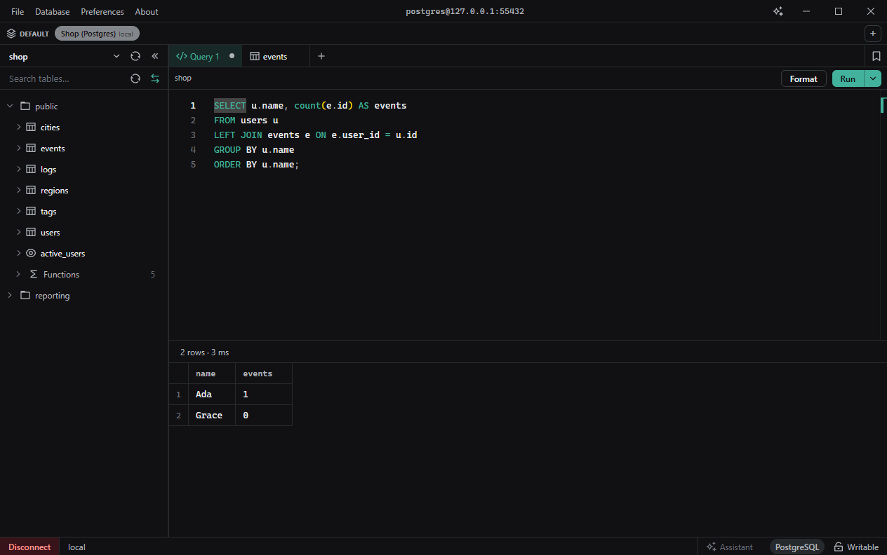
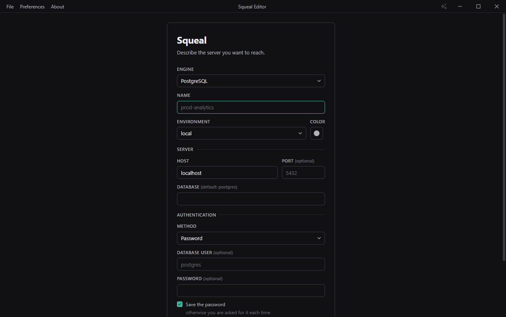

# Squeal Editor

A multi-database SQL editor for PostgreSQL, MySQL, and SQLite.

Browse databases and tables in a sidebar, click a table to preview it, or write
SQL by hand and run it.

|                                     |                                 |
| ----------------------------------- | ------------------------------- |
|  |  |

## Install

Download the latest release for your OS from the
[Releases page](https://github.com/Vincent-Lavallee/squeal-editor/releases/latest):

| OS      | Download                                                                             |
| ------- | ------------------------------------------------------------------------------------ |
| Windows | `squeal-editor-*.exe` installer                                                      |
| macOS   | `squeal-editor-macos-*.dmg`                                                          |
| Linux   | not shipped yet — build from source                                                  |

## Features

- Connect to PostgreSQL, MySQL, or SQLite databases.
- Save connections and organize them by workspace, so you can keep, say, work
  and personal databases separate.
- Connect to AWS RDS with IAM authentication instead of a stored password.
- Browse a database's schemas, tables, and columns in a searchable sidebar
  tree.
- Click a table to preview its rows, or write and run SQL by hand with
  autocomplete for keywords, tables, and columns.